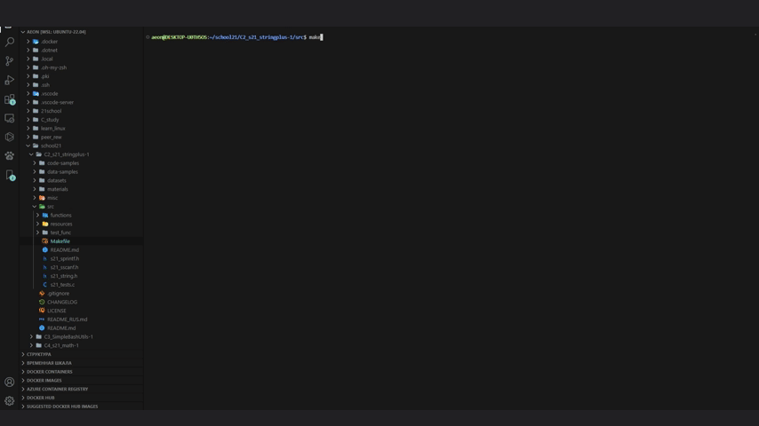

# s21_string+


## Оглавление

* [Введение](#введение)
* [Зависимости](#зависимости)
* [Сборка](#сборка)
* [Тесты](#тесты)

### Реализация задания

[Обязательная часть №1: реализация функций библиотеки string.h](#обязательная-часть-1)  
[Обязательная часть №2: частичная реализация функции sprintf](#обязательная-часть-2)  
[Дополнительное задание №1: реализация некоторых модификаторов формата функции sprintf](#дополнительное-задание-1)  
[Дополнительное задание №2: реализация функции sscanf](#дополнительное-задание-2)  
[Дополнительное задание №3: реализация специальных функций обработки строк](#дополнительное-задание-3)  
[Реализованные требования к проекту](#реализованы-следующие-требования-к-проекту)


## Введение

- Авторская реализация библиотеки string.h  
- Реализация функций sprintf и sscanf

Разработано командой dance_with_pedago() {

    maggytel  
    shanikat  
    holdosto  
    foldeslu  
    fungusgr  
}


## Зависимости  

***Для работы программы необходим Homebrew и установленная дбиблиотека check + утилиты lcov и gcov.***  

Проверка их наличия и установка осуществляется с помощью скриптов install_brew.sh и check_gcov_lcov.sh командой `make check`  

<details>
  <summary>Команды для ручной установки</summary>

  | № | Ресурс   | Команда Linux                      | Команда MacOs |
  |---|----------|------------------------------------|----------------|
  | 1 | check.h: | sudo apt-get install check         | brew install check |
  | 2 | lcov:    | sudo apt-get install lcov          | brew install lcov |
  | 3 | gcov:    | sudo apt-get install gcov          | xcode-select --install |

  Также возможно понадобится

  | № | Команда Linux                      | Команда MacOs |
  |---|------------------------------------|----------------|
  | 1 | sudo apt-get update                | brew update    |
  | 2 | sudo apt-get install --fix-missing |                |

  Для установки Brew: `curl -fsSL https://rawgit.com/kube/42homebrew/master/install.sh | zsh`

</details>


### Использование

Для использования библиотеки необходимо скомпилировать проект, включая исходный код библиотеки и модульные тесты, с помощью Makefile.  


## Сборка

```
$ git clone ssh://git@repos-ssh.21-school.ru:2289/students/C2_s21_stringplus.ID_395950/Team__TL__fungusgr_student.21_school.ru_.kjSobWgcRrqi87I6bYEjpw/C2_s21_stringplus-1.git
$ cd C2_s21_stringplus-1/src
$ git switch develop  
$ make check
$ make

```


## Тесты

Модульные и юнит-тесты реализованы при помощи библиотеки Check и утилиты gcov.  
Тесты сравнивают результаты работы стандартной библиотеки string с результатами s21_string.h  
Unit-тесты покрывают более 80% каждой функции.  
После отрабатывания всех тестов программа генерирует отчет gcov в форме html-страницы.  

После завершения работы программы с модульными тестами, проводится проверка на стиль и cppcheck. 




## Обязательная часть 1 
### Реализация функций библиотеки string.h  

| № | Переменная   | Описание     |
| - | ------------ | ------------ |
| 1 | `s21_size_t` | Целочисленный тип без знака, являющийся результатом ключевого слова sizeof.
| 2 | `s21_NULL`   | Макрос, являющийся значением константы нулевого указателя.


| №  | Функция | Описание | Разработчик | Статус |
| -- | ------- | -------- | ----------- | ------ |
| 1 | `void *memchr(const void *str, int c, size_t n)` | Выполняет поиск первого вхождения символа c (беззнаковый тип) в первых n байтах строки, на которую указывает аргумент str. | shanikat  | DONE |  
| 2 | `int memcmp(const void *str1, const void *str2, size_t n)` | Сравнивает первые n байтов str1 и str2. | foldeslu  | DONE |  
| 3 | `void *memcpy(void *dest, const void *src, size_t n)` | Копирует n символов из src в dest. | holdosto  | DONE |
| 4 | `void *memset(void *str, int c, size_t n)` | Копирует символ c (беззнаковый тип) в первые n символов строки, на которую указывает аргумент str. | holdosto | DONE |  
| 5 | `char *strncat(char *dest, const char *src, size_t n)` | Добавляет строку, на которую указывает src, в конец строки, на которую указывает dest, длиной до n символов. | shanikat | DONE |  
| 6	| `char *strchr(const char *str, int c)` | Выполняет поиск первого вхождения символа c (беззнаковый тип) в строке, на которую указывает аргумент str. | shanikat | DONE |  
| 7 | `int strncmp(const char *str1, const char *str2, size_t n)` | Сравнивает не более первых n байтов str1 и str2. | foldeslu | DONE |  
| 8 | `char *strncpy(char *dest, const char *src, size_t n)` | Копирует до n символов из строки, на которую указывает src, в dest. | holdosto | DONE |  
| 9 | `size_t strcspn(const char *str1, const char *str2)` | Вычисляет длину начального сегмента str1, который полностью состоит из символов, не входящих в str2. | fungusgr | DONE |  
| 10 | `char *strerror(int errnum)` | Выполняет поиск во внутреннем массиве номера ошибки errnum и возвращает указатель на строку с сообщением об ошибке. Нужно объявить макросы, содержащие массивы сообщений об ошибке для операционных систем mac и linux. Описания ошибок есть в оригинальной библиотеке. Проверка текущей ОС осуществляется с помощью директив. | fungusgr | DONE |  
| 11 | `size_t strlen(const char *str)` | Вычисляет длину строки str, не включая завершающий нулевой символ. | fungusgr | DONE |
| 12 | `char *strpbrk(const char *str1, const char *str2)` | Находит первый символ в строке str1, который соответствует любому символу, указанному в str2. | maggytel | DONE |  
| 13 | `char *strrchr(const char *str, int c)` | Выполняет поиск последнего вхождения символа c (беззнаковый тип) в строке, на которую указывает аргумент str. | maggytel | DONE |  
| 14 | `char *strstr(const char *haystack, const char *needle)` | Находит первое вхождение всей строки needle (не включая завершающий нулевой символ), которая появляется в строке haystack. | maggytel | DONE |  
| 15 | `char *strtok(char *str, const char *delim)` | Разбивает строку str на ряд токенов, разделенных delim. | foldeslu | DONE |  


***Так как запрещено использование системных списков ошибок, включая списки, непрописанные в стандартах POSIX (sys_nerr, sys_errlist), реализован свой (возвожно)платформозависимый список ошибок, как это упомянуто в описании функции `strerror`***  


## Обязательная часть 2 
### Частичная реализация функции sprintf

| Разработано участниками |
| ----------- |
|  fungusgr   |
|  shanikat   |

- `int sprintf(char *str, const char *format, ...)` - отправляет форматированный вывод в строку, на которую указывает str.
где:
- `str` − Это С-строка, которую функция обрабатывает в качестве источника для записи данных;
- `format` −  это С-строка, содержащая один или несколько следующих элементов: пробельный символ, непробельный символ и спецификаторы формата.  
Спецификатор формата для печатающих функций следует прототипу: `%[флаги][ширина][.точность][длина]спецификатор`.  

Реализована функция s21_sprintf из библиотеки stdio.h:
- Функция размещена в библиотеке s21_string.h.  
- Функция поддерживает частичное форматирование:
  - Спецификаторы: `c`, `d`, `f`, `s`, `u`, `%`  
  - Флаги: `-`, `+`, `(пробел)`  
  - Ширина: `(число)`  
  - Точность: `.(число)`  
  - Длина: `h`, `l`  

  | № | Спецификатор | Результат sprintf |
  | --- | --- | --- |
  | 1 | c | Символ |
  | 2 | d | Знаковое десятичное целое число |
  | 3 | f | Десятичное число с плавающей точкой | YES
  | 4 | s | Строка символов |
  | 5 | u | Беззнаковое десятичное целое число |
  | 6 | % | Символ % |

  | № | Флаг | Описание |
  | --- | --- | --- |
  | 1 | - | Выравнивание по левому краю в пределах заданной ширины поля. Выравнивание по правому краю используется по умолчанию (см. подспецификатор ширины). |
  | 2 | + | Заставляет явно указывать знак плюс или минус (+ или -) даже для положительных чисел. По умолчанию только отрицательным числам предшествует знак "-". |
  | 3 | (пробел) | Если знак не будет выведен, перед значением вставляется пробел. |

  | № | .точность | Описание |
  | --- | --- | --- |
  | 1	| .число | Для целочисленных спецификаторов (d, i, o, u, x, X) − точность определяет минимальное количество записываемых цифр. Если записываемое значение короче этого числа, результат дополняется ведущими нулями. Значение не усекается, даже если результат длиннее. Точность 0 означает, что для значения 0 не записывается ни одного символа. Для спецификаторов e, E и f − это количество цифр, которые должны быть напечатаны после десятичной точки. Для спецификаторов g и G − это максимальное количество значащих цифр, которые должны быть напечатаны. Для s − это максимальное количество печатаемых символов. По умолчанию все символы печатаются до тех пор, пока не встретится терминирующий нуль. Для типа с − никак не влияет. Если точность не указана для спецификаторов e, E, f, g и G, то по умолчанию ее значение равно 6. Если точность не указана для остальных спецификаторов, то по умолчанию ее значение равно 1. Если число не указано (нет явного значения точности), то по умолчанию - 0. |

  | № | Ширина | Описание |
  | --- | --- | --- |
  | 1	| (число) | Минимальное количество печатаемых символов. Если выводимое значение короче этого числа, результат дополняется пробелами. Значение не усекается, даже если результат больше. |


  | № | Длина | Описание |
  | --- | --- | --- |
  | 1 | h | Аргумент интерпретируется как короткое int или короткое int без знака (применяется только к целочисленным спецификаторам: i, d, o, u, x и X). |
  | 2 | l | Аргумент интерпретируется как длинное int или длинное int без знака для целочисленных спецификаторов (i, d, o, u, x и X) и как широкий символ или строка широких символов для спецификаторов c и s. |


## Дополнительное задание 1 
### Реализация некоторых модификаторов формата функции sprintf  

| Разработано участниками |
| ----------- |
|  fungusgr   |
|  shanikat   |

Реализованы некоторые модификаторы формата функции s21_sprintf:  
- Функция размещена в библиотеке s21_string.h.  
- Функция поддерживает следующие дополнительные модификаторы формата:  
  - Спецификаторы: `g`, `G`, `e`, `E`, `x`, `X`, `o`, `p`  
  - Флаги: `#`, `0`  
  - Ширина: `*`  
  - Точность: `.*`  
  - Длина: `L`  

  | № | Спецификатор | Результат sprintf |
  | --- | --- | --- |
  | 1 | g | Использует кратчайший из представлений десятичного числа |
  | 2 | G | Использует кратчайший из представлений десятичного числа |
  | 3 | e | Научная нотация (мантисса/экспонента) с использованием символа e (вывод чисел должен совпадать с точностью до e-6) |
  | 4 | E | Научная нотация (мантисса/экспонента) с использованием символа Е |
  | 5 | x | Беззнаковое шестнадцатеричное целое число |
  | 6 | X | Беззнаковое шестнадцатеричное целое число (заглавные буквы) |
  | 7 | o | Беззнаковое восьмеричное число |
  | 8 | p | Адрес указателя |

  Неопознанные спецификаторы (возможно только для sscanf)
  | 0 | i | Знаковое десятичное целое число |
  | 1 | n | Количество символов, напечатанных до появления %n |


  | № | Флаг | Описание |
  | --- | --- | --- |
  | 1 | # | При использовании со спецификаторами o, x или X перед числом вставляется 0, 0x или 0X соответственно (для значений, отличных от нуля). При использовании с e, E и f "заставляет" записанный вывод содержать десятичную точку, даже если за ней не последует никаких цифр. По умолчанию, если не следует никаких цифр, десятичная точка не записывается. При использовании с g или G результат такой же, как и с e или E, но конечные нули не удаляются. |
  | 2 | 0 | Заполняет число слева нулями (0) вместо пробелов, где указан спецификатор ширины (см. подспецификатор ширины). |

  | № | .точность | Описание |
  | --- | --- | --- |
  | 1	| .* | Точность указывается не в строке формата, а в качестве дополнительного аргумента целочисленного значения, предшествующего аргументу, который должен быть отформатирован. |

  | № | Ширина | Описание |
  | --- | --- | --- |
  | 1 | * | В sprintf знак * значит, что ширина указывается не в строке формата, а в качестве дополнительного аргумента целочисленного значения, предшествующего аргументу, который необходимо отформатировать. В sscanf знак *, помещенный после % и перед спецификатором формата, считывает данные указанного типа, но подавляет их присваивание. |


  | № | Длина | Описание |
  | --- | --- | --- |
  | 1 | L | Аргумент интерпретируется как длинный double (применяется только к спецификаторам с плавающей точкой − e, E, f, g и G). |


## Дополнительное задание 2 
### Реализация функции sscanf

| Разработано участником |
| ----------- |
|  holdosto   |

- `int sscanf(const char *str, const char *format, ...)` - считывает форматированный ввод из строки.

Спецификатор формата для сканирующих функций следует прототипу: `%[*][ширина][длина]спецификатор`.

Реализована функция s21_sscanf из библиотеки stdio.h:
- Функции размещены в библиотеке s21_string.h  
- Должно поддерживаться полное форматирование (с учетом флагов, ширины, точности, модификаторов и типов преобразования).


Спецификаторы
  | № | Спецификатор | Результат sscanf |
  | --- | --- | --- |
  | 1 | c | Символ |
  | 2 | d | Знаковое десятичное целое число |
  | 3 | i | Знаковое целое число (может быть десятичным, восьмеричным или шестнадцатеричным) |
  | 4 | e | Десятичное число с плавающей точкой или научная нотация (мантисса/экспонента) |
  | 5 | E | Десятичное число с плавающей точкой или научная нотация (мантисса/экспонента) |
  | 6 | f | Десятичное число с плавающей точкой или научная нотация (мантисса/экспонента) |
  | 7 | g | Десятичное число с плавающей точкой или научная нотация (мантисса/экспонента) |
  | 8 | G | Десятичное число с плавающей точкой или научная нотация (мантисса/экспонента) |
  | 9 | o | Беззнаковое восьмеричное число |
  | 10 | s | Строка символов |
  | 11 | u | Беззнаковое десятичное целое число |
  | 12 | x | Беззнаковое шестнадцатеричное целое число (любые буквы) |
  | 13 | X | Беззнаковое шестнадцатеричное целое число (любые буквы) |
  | 14 | p | Адрес указателя |
  | 15 | n | Количество символов, считанных до появления %n |
  | 16 | % | Символ % |

Ширина
  | № | Ширина | Описание |
  | --- | --- | --- |
  | 1	| (число) | Минимальное количество печатаемых символов. Если выводимое значение короче этого числа, результат дополняется пробелами. Значение не усекается, даже если результат больше. |
  | 2 | * | В sprintf знак * значит, что ширина указывается не в строке формата, а в качестве дополнительного аргумента целочисленного значения, предшествующего аргументу, который необходимо отформатировать. В sscanf знак *, помещенный после % и перед спецификатором формата, считывает данные указанного типа, но подавляет их присваивание. |  

  | № | Длина | Описание |
  | --- | --- | --- |
  | 1 | h | Аргумент интерпретируется как короткое int или короткое int без знака (применяется только к целочисленным спецификаторам: i, d, o, u, x и X). |
  | 2 | l | Аргумент интерпретируется как длинное int или длинное int без знака для целочисленных спецификаторов (i, d, o, u, x и X) и как широкий символ или строка широких символов для спецификаторов c и s. |
  | 3 | L | Аргумент интерпретируется как длинный double (применяется только к спецификаторам с плавающей точкой − e, E, f, g и G). |  


## Дополнительное задание 3 
### Реализация специальных функций обработки строк

| №  | Функция | Описание | Разработчик | Статус |
| -- | ------- | -------- | ----------- | ------ |
| 1 | `void *to_upper(const char *str)` | Возвращает копию строки (str), преобразованной в верхний регистр. В случае какой-либо ошибки следует вернуть значение NULL | fungusgr | DONE |
| 2 | `void *to_lower(const char *str)` | Возвращает копию строки (str), преобразованной в нижний регистр. В случае какой-либо ошибки следует вернуть значение NULL | fungusgr | DONE |
| 3 | `void *insert(const char *src, const char *str, size_t start_index)` | Возвращает новую строку, в которой указанная строка (str) вставлена в указанную позицию (start_index) в данной строке (src). В случае какой-либо ошибки следует вернуть значение NULL | shanikat | DONE |
| 4 | `void *trim(const char *src, const char *trim_chars)` | Возвращает новую строку, в которой удаляются все начальные и конечные вхождения набора заданных символов (trim_chars) из данной строки (src). В случае какой-либо ошибки следует вернуть значение NULL | shanikat | DONE |

- Функции размещены в библиотеке s21_string.h  


## Реализованы следующие требования к проекту

Разработано на языке C стандарта C11 и POSIX.1-2017 с использованием компилятора gcc.  
Код библиотеки располагается в папке src в ветке develop.  
Использован стиль разработки Google.  

Статическая библиотека реализована с заголовочным файлом `s21_string.h`  
Реализовано полное покрытие unit-тестами функций библиотеки c помощью Check  
Makefile используется для сборки библиотеки и тестов, включая цели `all`, `clean`, `test`, `s21_string.a`, `gcov_report`.  
Реализована логика работы как в стандартной библиотеке string.h.  

<details>
  <summary>Функции работатают с z-строками из однобайтовых символов в кодировке ASCII.</summary>  

  Требование, чтобы функции работали с z-строками из однобайтовых символов в кодировке ASCII, означает, что функции должны принимать и обрабатывать строки, содержащие символы только из набора ASCII, который состоит из 128 символов, таких как буквы английского алфавита (в верхнем и нижнем регистре), цифры, знаки пунктуации и некоторые специальные символы.    
  Кодировка ASCII использует один байт (8 бит) для представления каждого символа. Поэтому функции должны корректно обрабатывать строки, состоящие из символов, кодируемых одним байтом в пределах ASCII.  

</details>
